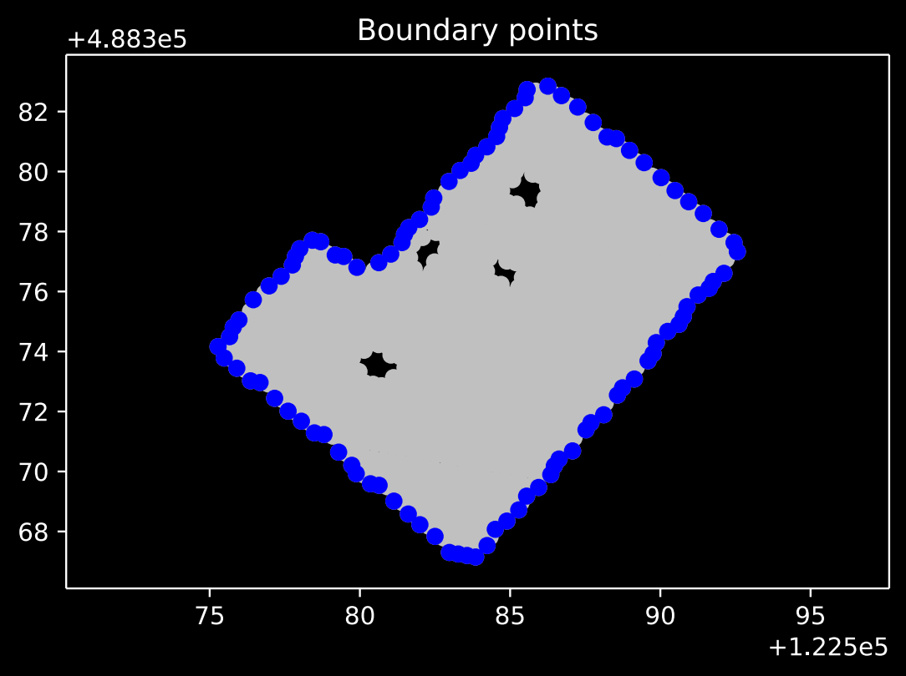
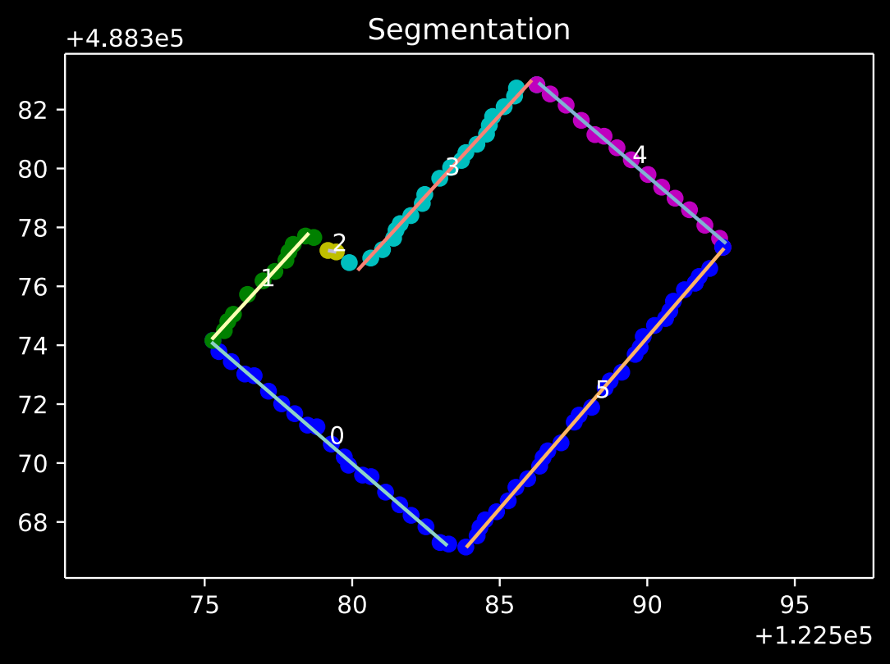
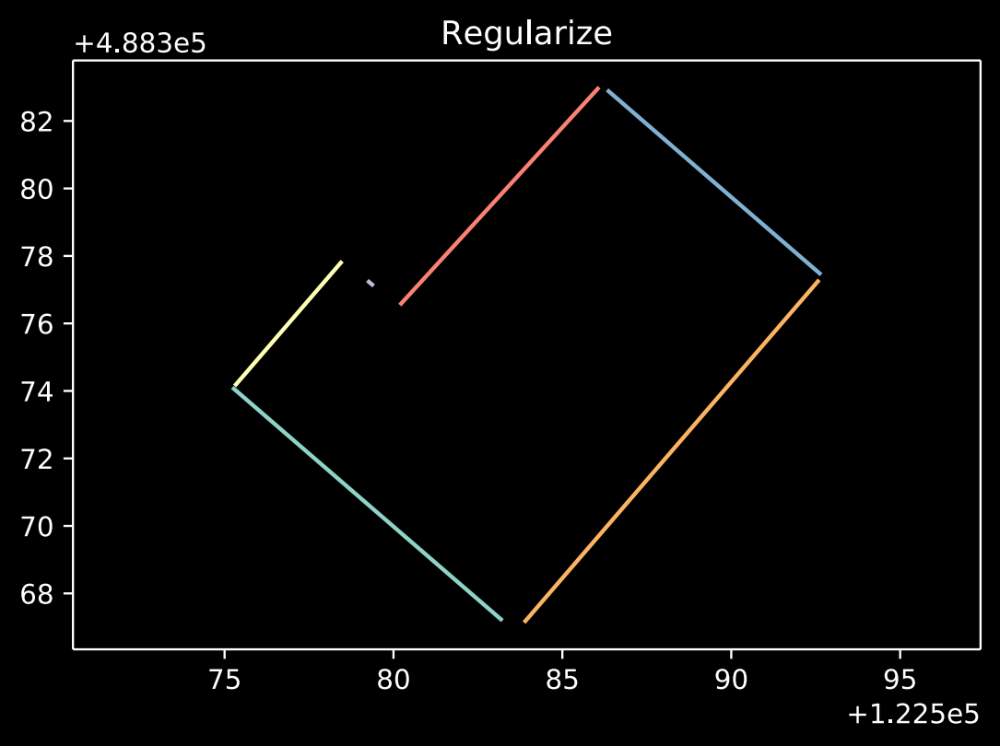
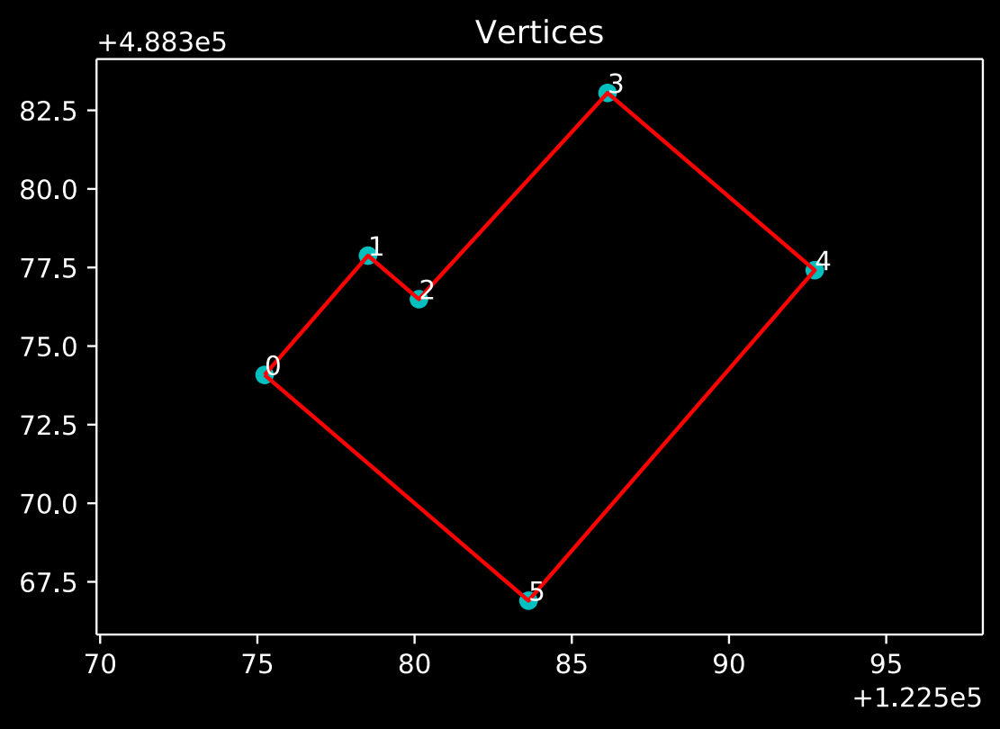
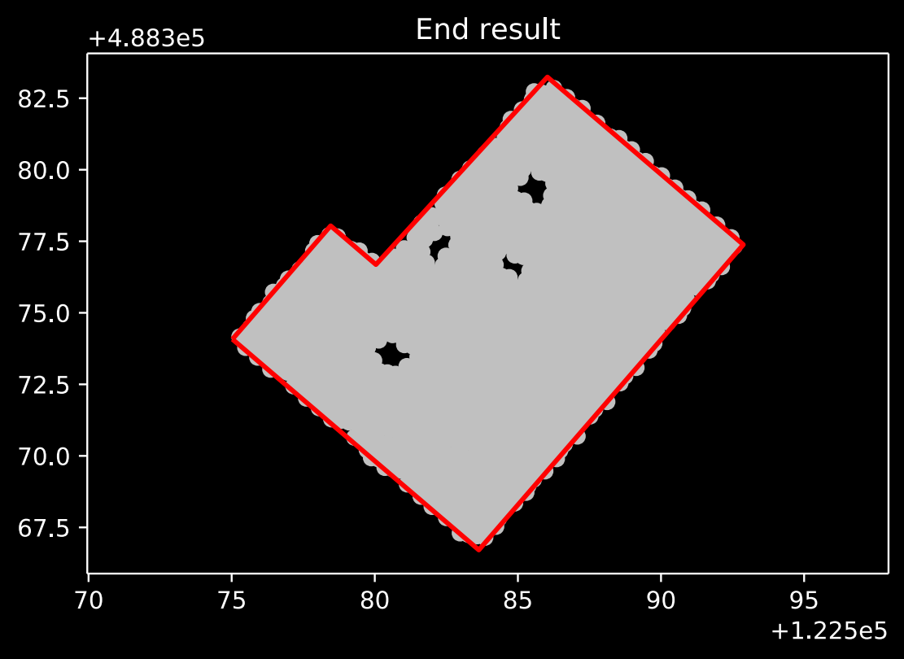

=================
Building Boundary
=================

Traces the boundary of a set of points belonging to an aerial LiDAR scan of a building (part). It attempts to optimize the boundary by exploiting the (most often) rectilinearity of buildings. It will look for the primary orientations of the building and try to regularize all boundary lines to these orientations (or the perpendicular).

The basic steps of the algorithm are as follows:

1. Determine the boundary points
2. Check if the shape matches a basic shape (rectangle or triangle), if so return this basic shape
3. Segment the boundary points in to wall segments
4. Fit a line to each segment
5. Determine the primary orientations
6. Regularize the lines to the primary orientations
7. Merge subsequent parallel lines
8. Compute the intersections of the lines

Prerequisites
=============

- python >= 3.6
- pip >= 19.1
- concave-hull_ >= 1.0
- pymintriangle_ >= 0.1
- CGAL (with SWIG python bindings) >= 4.12 (optional, drastically improves computation time of alpha shapes)

.. _concave-hull: https://github.com/Geodan/concave-hull
.. _pymintriangle: https://github.com/Geodan/pymintriangle

Install
=======

.. code-block:: sh

    pip install .

Usage
=====

.. code-block:: python

    import numpy as np
    import building_boundary

    points = np.array([
        [122336.637, 489292.815],
        [122336.233, 489291.98 ],
        [122336.258, 489292.865],
        [122335.234, 489293.104],
        [122336.448, 489293.46 ],
        [122334.992, 489293.68 ],
        [122335.987, 489292.778],
        [122335.383, 489292.746],
        [122336.509, 489293.173],
        [122335.794, 489293.425],
        [122335.562, 489293.121],
        [122335.469, 489293.406],
        [122335.944, 489293.734],
        [122335.3  , 489293.697],
        [122336.574, 489292.414],
        [122336.2  , 489292.31 ],
        [122335.907, 489292.296],
        [122335.599, 489292.281],
        [122335.686, 489292.762],
        [122336.842, 489293.192],
        [122335.886, 489293.139],
        [122335.094, 489292.733],
        [122336.146, 489293.444],
        [122336.193, 489293.157],
        [122335.154, 489293.389],
        [122335.643, 489293.717]
    ])
    vertices = building_boundary.trace_boundary(
        points,
        0.3,
        max_error=0.4,
        alpha=0.5,
        k=5,
        num_points=10,
        merge_distance=0.6
    )

Documentation
=============

trace_boundary
~~~~~~~~~~~~~~

Trace the boundary of a set of 2D points.

Parameters
----------
points : (Mx2) array
    The coordinates of the points.
ransac_threshold : float
    Maximum distance for a data point to be classified as an inlier during
    the RANSAC line fitting.
max_error : float
    The maximum error (distance) a point can have to a computed line.
alpha : float
    Set to determine the boundary points using an alpha shape using this
    chosen alpha. If both alpha and k are set both methods will be used and
    the resulting shapes merged to find the boundary points.
k : int
    Set to determine the boundary points using a knn based concave hull
    algorithm using this amount of nearest neighbors. If both alpha and k
    are set both methods will be used and the resulting shapes merged to
    find the boundary points.
num_points : int, optional
    The number of points a segment needs to be supported by to be
    considered a primary orientation. Will be ignored if primary
    orientations are set manually.
angle_epsilon : float, optional
    The angle (in radians) difference within two angles are considered the
    same. Used to merge segments.
merge_distance : float, optional
    If the distance between two parallel sequential segments (based on the
    angle epsilon) is lower than this value the segments get merged.
primary_orientations : list of floats, optional
    The desired primary orientations (in radians) of the boundary. If set
    manually here these orientations will not be computed.
perp_dist_weight : float, optional
    Used during the computation of the intersections between the segments.
    If the distance between the intersection of two segments and the
    segments is more than `perp_dist_weight` times the distance between the
    intersection of the perpendicular line at the end of the line segment
    and the segments, the perpendicular intersection will be used instead.
inflate : bool, optional
    If set to true the fit lines will be moved to the furthest outside
    point.

Returns
-------
vertices : (Mx2) array
    The vertices of the computed boundary line
